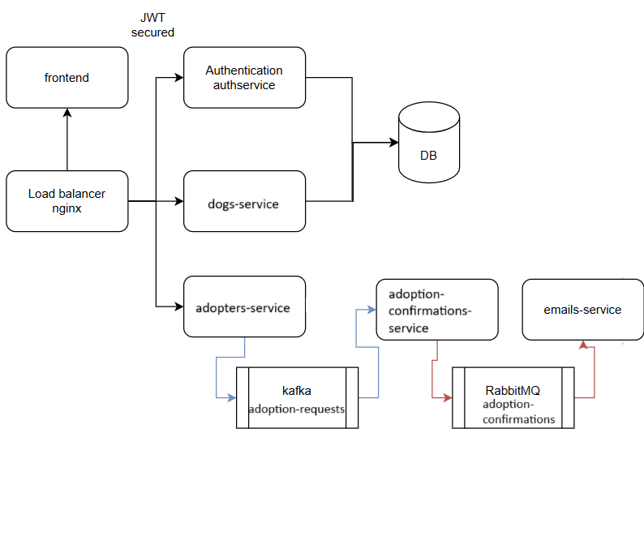

# SOA
# Dog Adoption Platform

This application was developed as an online pet adoption platform, which allows users to view details about available dogs for adoption and submit adoption requests. The platform is designed for individuals interested in adopting dogs or simply viewing more information about these pets online.

It displays a list of dogs available for adoption, and the user can view details about each dog. To submit an adoption request, the user must be logged in, while viewing the dog details does not require authentication. After the adoption request is processed, a confirmation email is sent to the user (simulated as a console message for now).

To summarize, a user can:
- Log in.
- View the list of available dogs for adoption.
- View details about a dog.
- Submit an adoption request for that dog.

## Backend Architecture

The backend consists of six microservices, each having a different role:

- **Authentication Service (authservice):** Handles user login.
- **Load Balancer (nginx):** Distributes requests between different services.
- **Dogs Service (dogs-api):** Provides the list of available dogs for adoption and their details.
- **Adoption Service (adopters-api):** Handles submission of adoption requests and communication with Kafka.
- **Adoption Confirmation Service (adoption-confirmation-service):** Processes the adoption requests from Kafka and sends confirmation emails using RabbitMQ.
- **Email Service (email-service):** Simulates sending an email with adoption confirmation.

The load balancer routes requests between authservice, dogs-api, and adopters-api. The adopters-api communicates with adoption-confirmation-service through a Kafka queue, and the adoption-confirmation-service communicates with email-service through a RabbitMQ queue.

## An overview of the app services in the backend can be seen in the diagram below:


The frontend is a separate microservice that exposes pages for:
- Login
- Viewing the dogs
- Viewing the details about a dog

The application uses Docker for creating the images and deploying the containers.


In order to start the application, you have to run the followinf command in the backend folder.
```bash
docker-compose up
```
